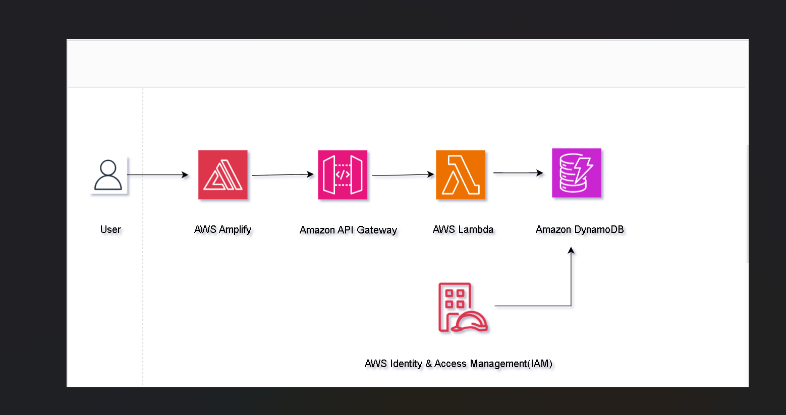

# End-End AWS-Web-Application

## Overview

This project demonstrates the deployment of a web application on AWS using various services such as AWS Amplify, AWS Lambda, Amazon API Gateway, Amazon DynamoDB, and AWS Identity & Access Management(IAM).

## Architecture Diagram

## Deployment Steps

### Step 1: Setting Up AWS Amplify

1. Log in to the AWS Management Console.
2. Navigate to AWS Amplify service.
3. Click on "Get Started" and follow the instructions to set up your Amplify project.
4. Configure your backend resources such as Lambda functions, API Gateway, and DynamoDB tables.

### Step 2: Creating Lambda Functions

1. Go to the AWS Lambda service in the AWS Management Console.
2. Create Lambda functions for handling backend logic.
3. Write and upload your function code.
4. Configure IAM roles for Lambda functions with appropriate permissions.

### Step 3: Setting Up API Gateway

1. Navigate to Amazon API Gateway in the AWS Management Console.
2. Create a new API.
3. Define endpoints and integrate them with Lambda functions.
4. Set up IAM permissions for API Gateway to access Lambda functions.

### Step 4: Configuring DynamoDB

1. Access Amazon DynamoDB in the AWS Management Console.
2. Create tables to store data required for the application.
3. Define primary keys and indexes as needed.
4. Configure IAM permissions for DynamoDB access.

### Step 5: IAM Configuration

1. Go to AWS IAM service in the AWS Management Console.
2. Create IAM roles and policies for granting permissions to various services.
3. Ensure proper least privilege principles are followed.

## Repository Contents

This repository contains the following files and directories:

1. `diagram.png`: Architecture diagram of the project.
2. `lambda_functions/`: Directory containing Lambda function code.
3. `amplify/`: Directory containing AWS Amplify configuration files.
4. `README.md`: This README file providing an overview of the project.

## Getting Started

To deploy this project locally, follow these steps:

1. Clone the repository to your local machine.
2. Set up AWS credentials on your machine using AWS CLI.
3. Navigate to the `amplify/` directory and run `amplify init` to initialize the Amplify project.
4. Follow the prompts to configure the Amplify project.
5. Run `amplify push` to deploy the project to AWS.

